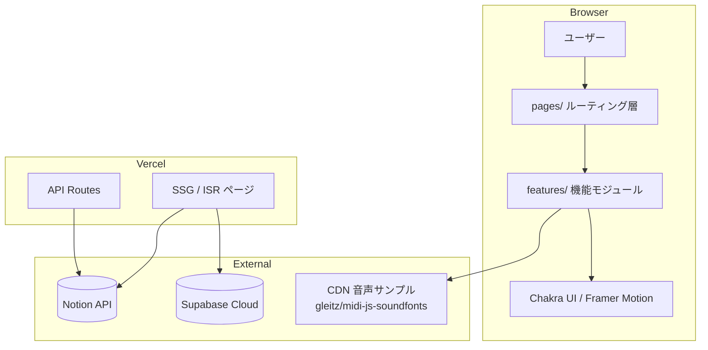
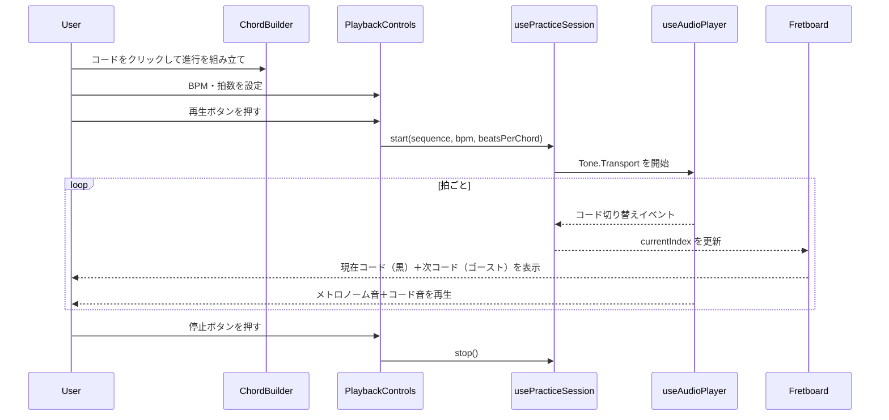
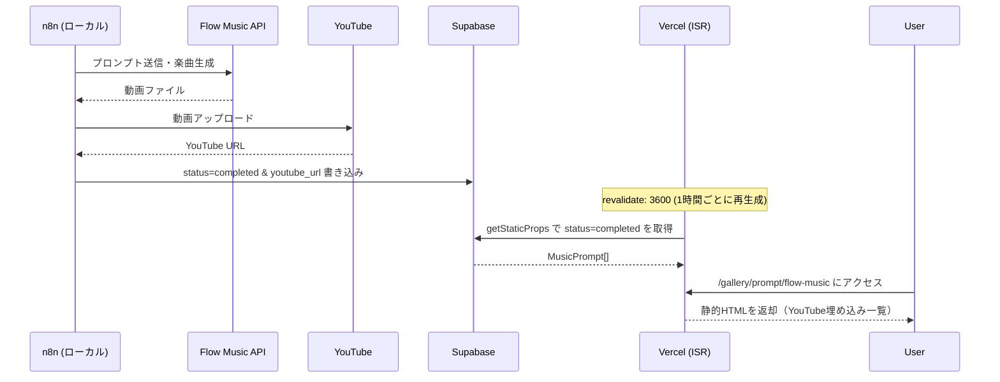
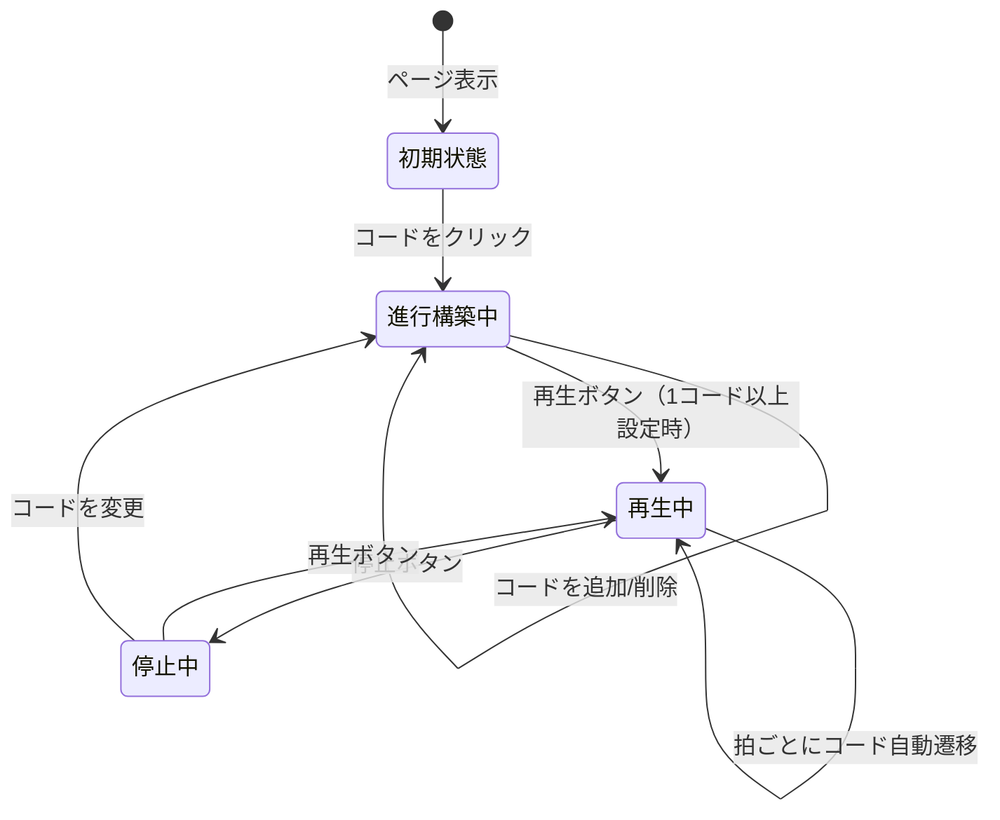

# 機能設計書 (Functional Design Document)

## システム構成図



---

## 技術スタック

| 分類 | 技術 | 選定理由 |
|------|------|----------|
| フレームワーク | Next.js 14 (Pages Router) | 既存構成・SSG/ISR・API Routes |
| 言語 | TypeScript | 型安全・既存構成 |
| UI | Chakra UI + Framer Motion | 既存構成・アクセシビリティ |
| 音声 | Tone.js | BPMスケジュール再生・サンプラー機能 |
| 音源 | gleitz/midi-js-soundfonts (CDN) | ライセンスフリーのギター音源 |
| 外部DB | Supabase (クラウド版) | flowmusic データの公開ホスティング |
| データソース | Notion API | 記事データ |
| テスト | Vitest + @testing-library/react | 既存構成 |
| デプロイ | Vercel | 既存構成 |

---

## データモデル定義

### ChordRunner — コード定義

```typescript
/** ギター弦ごとの押さえ方 */
interface FretPosition {
  string: 1 | 2 | 3 | 4 | 5 | 6; // 1=1弦(高音)〜6=6弦(低音)
  fret: number;                    // 0=開放弦、-1=ミュート
  finger?: 1 | 2 | 3 | 4;         // 使用指（省略可）
}

/** コード定義データ */
interface ChordDefinition {
  name: string;              // "C", "Am", "F" など
  positions: FretPosition[]; // 弦ごとの押さえ位置
  audioNote: string;         // Tone.js Sampler に渡すルートノート e.g. "C3"
}

/** 練習セッションの状態 */
interface PracticeSession {
  sequence: string[];        // コード名の配列 e.g. ["C", "G", "Am", "F"]
  bpm: number;               // 40〜200
  beatsPerChord: number;     // 1コードあたりの拍数（2 or 4）
  isPlaying: boolean;
  currentIndex: number;      // 現在のコードインデックス
}
```

**制約**:
- `bpm`: 40〜200 の整数
- `sequence`: 1〜16 コード
- `beatsPerChord`: 2 または 4

### flowmusic — 音楽プロンプト（Supabase テーブル定義）

```typescript
/** Supabase music_prompts テーブルの型 */
interface MusicPrompt {
  id: string;                        // UUID (Primary Key)
  prompt_text: string;               // 音楽生成に使ったプロンプト
  status: 'pending' | 'completed';   // pending=生成待ち、completed=公開可
  youtube_main_url: string | null;   // MV の YouTube URL
  youtube_short_url: string | null;  // ショート動画の YouTube URL
  created_at: string;                // ISO 8601 datetime
}
```

---

## コンポーネント設計

### ChordRunner フィーチャー構成

```
src/features/gallery/tool/chord-runner/
├── types/
│   └── index.ts          # ChordDefinition, PracticeSession 型
├── utils/
│   ├── chordData.ts      # 全コード定義データ（10種）
│   └── fretboardUtils.ts # 指板座標計算ロジック
├── hooks/
│   ├── usePracticeSession.ts  # セッション状態管理（BPM・再生制御）
│   └── useAudioPlayer.ts      # Tone.js Sampler ラッパー
└── components/
    ├── ChordBuilder.tsx       # コード進行を組み立てるUI
    ├── Fretboard.tsx          # 指板SVG描画（現在＋ゴースト表示）
    ├── FretDot.tsx            # 単一押さえ位置ドット
    ├── BpmControl.tsx         # BPMスライダー・数値入力
    └── PlaybackControls.tsx   # 再生・停止・拍数設定
```

**各コンポーネントの責務**:

| コンポーネント | 責務 |
|---|---|
| `ChordBuilder` | コードボタン表示・タイムラインへの追加・並び替え |
| `Fretboard` | SVGで指板を描画、現在コード（黒）＋次コード（透過）を重ねて表示 |
| `FretDot` | 単一ドットのSVG要素。`isCurrent` / `isGhost` で見た目を切り替え |
| `usePracticeSession` | BPM・拍数に従いコードインデックスを進めるタイマーロジック |
| `useAudioPlayer` | Tone.js Sampler の初期化・コード音の再生・メトロノーム管理 |

### flowmusic フィーチャー構成

```
src/features/gallery/prompt/flow-music/
├── types/
│   └── index.ts              # MusicPrompt 型
└── components/
    ├── MusicCard.tsx          # 1曲分のカード（YouTube埋め込み・プロンプト表示）
    └── MusicList.tsx          # カード一覧グリッド

src/lib/supabase/
└── client.ts                  # Supabase クライアント初期化（サーバーサイド専用）
```

---

## アルゴリズム設計

### ゴーストフレット（オニオンスキン）表示

**目的**: 現在コードの運指と次コードの運指を同じ指板上に重ねて表示し、重複位置でも視認できるようにする。

**ロジック**:

```
現在コードのポジション → 黒ドット（opacity: 1, fill: "gray.800"）
次コードのポジション   → ゴーストドット

重複判定（同弦・同フレット）:
  └── 重複なし → ゴーストを透過円（opacity: 0.3, fill: "gray.400"）
  └── 重複あり → ゴーストを枠線のみの円（stroke: "gray.400", fill: "none", strokeWidth: 2）
```

**実装イメージ**:

```typescript
function resolveOverlap(current: FretPosition[], next: FretPosition[]): ResolvedDot[] {
  return next.map((pos) => {
    const isOverlap = current.some(
      (c) => c.string === pos.string && c.fret === pos.fret
    );
    return {
      ...pos,
      style: isOverlap ? 'ghost-outline' : 'ghost-filled',
    };
  });
}
```

### BPM タイマー（Tone.js Transport）

**目的**: 設定した BPM・拍数で正確にコードインデックスを進める。

```
Tone.Transport.bpm.value = bpm
Tone.Transport.scheduleRepeat((time) => {
  beatCount++
  if (beatCount % beatsPerChord === 0) {
    currentIndex = (currentIndex + 1) % sequence.length
    // メトロノームクリック音を再生
    // コードサンプル音を再生（time引数で正確にスケジュール）
  }
}, "4n")  // 4分音符ごとに実行
```

---

## ユースケース図

### ChordRunner — 練習フロー



### flowmusic — データ取得・表示フロー



---

## 画面遷移図

### ChordRunner



---

## API設計

### `/gallery/prompt/flow-music` (SSG + ISR)

```typescript
// pages/gallery/prompt/flow-music/index.tsx
export const getStaticProps: GetStaticProps = async () => {
  const supabase = createServerSupabaseClient();
  const { data: musics } = await supabase
    .from('music_prompts')
    .select('*')
    .eq('status', 'completed')
    .order('created_at', { ascending: false });

  return {
    props: { musics: musics ?? [] },
    revalidate: 3600, // 1時間ごとに再生成
  };
};
```

ChordRunner はクライアントサイドのみ（APIルートなし）。

---

## エラーハンドリング

| エラー種別 | 発生箇所 | 処理 | ユーザーへの表示 |
|-----------|---------|------|-----------------|
| Tone.js 音声ロード失敗 | `useAudioPlayer` | エラーを catch し無音で継続 | 「音声の読み込みに失敗しました。映像のみで練習できます」 |
| Supabase 取得失敗 | `getStaticProps` | `musics: []` で fallback | 「楽曲データを取得できませんでした」メッセージ表示 |
| Notion API 失敗 | `getStaticProps` (記事) | エラーページへリダイレクト | 既存の 500 ページ |
| BPM 範囲外 | `BpmControl` | 40〜200 にクランプ | 入力フォームのバリデーションメッセージ |

---

## テスト戦略

### ユニットテスト（Vitest）
- `fretboardUtils.ts`: 重複判定ロジック（`resolveOverlap`）
- `chordData.ts`: 全10コードのデータ完全性チェック
- `usePracticeSession`: BPM・拍数に応じたインデックス進行

### コンポーネントテスト（@testing-library/react）
- `Fretboard`: 現在コードが黒ドット・次コードがゴーストで表示されること
- `ChordBuilder`: コードを追加・削除できること
- `BpmControl`: 入力値が 40〜200 にクランプされること

### Storybook
- `Fretboard`: 各コード・ゴースト有無・重複ありのバリエーション
- `ChordBuilder`: 空・進行あり・最大16コードのバリエーション
